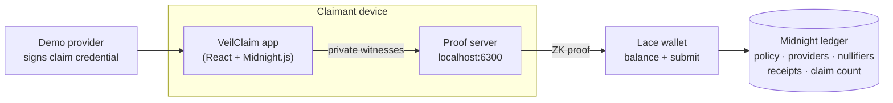

# VeilClaim

**Private insurance claims, publicly verified.**

VeilClaim lets a policyholder prove that a provider-attested insurance claim satisfies a policy's rules, and consume that claim exactly once, without revealing the claim amount, service date, or who they are.

```
private provider-attested claim  →  Midnight ZK proof  →  replay-safe public receipt
```

Built on [Midnight](https://midnight.network/) for the Midnight Buildathon, Wave 1.

> **Status: in progress.** The contract data model, admin circuits, API layer and UI shell are in place. `submitClaim` currently fails closed until the core proof path lands. See [Status](#status).

---

## Why Midnight

A normal backend can check a claim privately, but then the insurer sees every detail and has to be trusted to apply the rules correctly, not alter records, not approve the same claim twice, and not leak sensitive data.

With Midnight:

- claim data stays on the claimant's device and enters the contract only as private witness input;
- the Compact contract evaluates the policy rules inside a zero-knowledge circuit;
- the ledger verifies the proof and consumes the claim right atomically;
- the public record shows **that** a valid claim was accepted, never **what** was in it.

Take Midnight away and VeilClaim becomes trusted backend adjudication, which is a different product.

## How it works



1. An approved provider signs a claim credential for the policyholder.
2. The claimant loads the credential in the app. It never leaves the device.
3. The contract's `submitClaim` circuit runs locally with the credential as private witnesses, and the proof server generates a ZK proof.
4. Lace balances and submits the transaction.
5. The ledger verifies the proof, and in one atomic step records the claim nullifier, a receipt, and increments the accepted claim count. If anything fails, nothing is written.

### The proof statement

A successful `submitClaim` proves:

> I know a claim credential authenticated by a provider the contract recognizes. Its hidden category, service date and amount satisfy the referenced policy. I know the holder secret this credential is bound to. Its claim nullifier is unused. Consume it and record one accepted claim.

Concretely, the circuit checks (target design; see [Status](#status)):

| Check | Rule |
|-------|------|
| Policy | exists and is active |
| Provider | approved in the on-chain registry |
| Attestation | valid Schnorr signature (Jubjub) by that provider's key over the credential |
| Holder binding | `hash(holderSecret)` matches the credential's holder commitment |
| Category | equals the policy's covered category |
| Service date | within the policy's validity window, inclusive |
| Amount | at most the policy's cap |
| Replay | the derived claim nullifier has not been consumed |

## Public vs private state

| Public (on the ledger) | Private (witness input only) |
|------------------------|------------------------------|
| Policies: validity window, covered category, cap, active flag | Billed amount |
| Approved providers and their attestation keys | Service category and service date |
| Consumed claim nullifiers | Holder secret |
| Claim receipts: policy id + nullifier | Claim nonce and full credential |
| Accepted claim count | Provider signature |
| Admin commitment (a hash, not a key) | Claimant identity |

## Replay protection

Every claim maps to a single nullifier derived **inside the circuit** from the credential itself:

```
claimBinding   = H(providerId, policyId, claimNonce, credentialCommitment)
claimNullifier = H("veilclaim:claim:v1", contractAddress, policyId, claimBinding)
```

- A new session, a fresh proof, or a re-signed copy of the same claim produces the **same** nullifier, so it is rejected.
- A separate legitimate claim has its own nonce, and therefore its own nullifier.
- The caller cannot choose the nullifier. It is computed from signed, private data.
- Inserting the nullifier, writing the receipt and incrementing the count happen in one transaction. A failed proof leaves the ledger unchanged.

## Trust assumptions and limitations

VeilClaim proves a claim is correct **relative to authenticated claim data**. It does not prove the underlying event happened.

- A provider can sign a false claim. Provider honesty is out of scope.
- Clinical truth is not established.
- No real hospital or insurer system integration. Wave 1 uses a controlled demo provider.
- No payouts. The output is an authorization receipt.
- Provider onboarding is simplified to an admin-approved registry.
- Dates are integer epochs checked against a policy window, not a time oracle.
- Admin actions are authorized by proving knowledge of the admin secret, not by wallet key.

## Project structure

```
VeilClaim/
├── contract/                 Compact contract and tests
│   ├── src/veilclaim.compact   the contract
│   ├── src/witnesses.ts        private state and witness functions
│   └── test/                   Vitest suite against the compiled circuits
├── api/                      TypeScript API: deploy, join, circuit calls, public state
├── ui/                       React + Vite claimant app with Lace wallet wiring
└── proof-server/             Docker Compose for the local proof server
```

Tests run the **real compiled contract** in-process through `@midnight-ntwrk/compact-runtime`, not a TypeScript re-implementation of the rules.

## Getting started

### Prerequisites

- [Bun](https://bun.sh/) 1.3+ and Node.js 24
- [Compact toolchain](https://docs.midnight.network/) with compiler **0.31.1**
  ```bash
  curl --proto '=https' --tlsv1.2 -LsSf https://github.com/midnightntwrk/compact/releases/latest/download/compact-installer.sh | sh
  compact update 0.31.1
  ```
- Docker, for the proof server
- [Lace wallet](https://www.lace.io/) with Midnight enabled on **Preprod**, funded from the faucet with DUST generation on

### Install, compile, test

```bash
git clone https://github.com/0xMegie/VeilClaim-.git
cd VeilClaim-
bun install
bun run compact      # compile the contract and generate proving keys
bun run test
```

### Run the app

```bash
bun run proof-server   # terminal 1: proof server on http://localhost:6300
bun run dev            # terminal 2: app on http://localhost:3000
```

In Lace, set the proof server to `http://localhost:6300`. Copy `ui/.env.example` to `ui/.env` and set the contract address once deployed.

### Scripts

| Command | What it does |
|---------|--------------|
| `bun run compact` | Compile the contract with ZK proving keys |
| `bun run compact:fast` | Compile without keys, for quick iteration |
| `bun run test` | Run the contract test suite |
| `bun run typecheck` | Typecheck all workspaces |
| `bun run dev` | Start the app (needs a full `compact` first) |
| `bun run build` | Production build of the app |
| `bun run proof-server` | Start the local proof server |

### Toolchain versions

These move together. Upgrade them as a set.

| Component | Version |
|-----------|---------|
| Compact compiler | 0.31.1 |
| `@midnight-ntwrk/compact-runtime` | 0.16.0 |
| Midnight.js | 4.1.1 |
| Proof server image | `midnightntwrk/proof-server:8.0.3` |
| Network | Preprod |

## Status

- [x] Toolchain pinned, Bun workspace, CI
- [x] Contract data model, `createPolicy`, `setProviderStatus`
- [x] Simulator running the compiled circuits
- [x] API layer and UI shell with Lace wiring
- [ ] Provider attestation and `submitClaim` core path
- [ ] Full test suite: policy, provider, predicate boundaries, credential integrity, replay, atomicity, privacy
- [ ] Public deployment on Preprod with transaction evidence
- [ ] Policy and claim screens wired to the live contract
- [ ] Demo video
