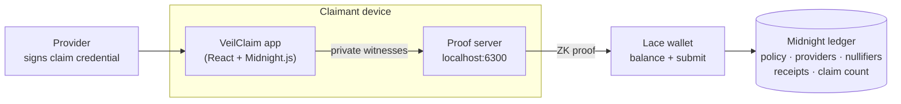

# VeilClaim

**Private insurance claims, publicly verified.**

VeilClaim lets a policyholder prove that a provider-attested insurance claim satisfies a policy's rules, and consume that claim exactly once, without revealing the claim amount, service date, or who they are.

```
private provider-attested claim  →  Midnight ZK proof  →  replay-safe public receipt
```

Built on [Midnight](https://midnight.network/) for the Midnight Buildathon, Wave 1.

> **Status:** contract, proof path, 55 tests and the claimant app are complete. Public Preprod deployment and the demo video are pending. See [Status](#status).

---

## Why Midnight

A normal backend can check a claim privately, but then the insurer sees every detail and has to be trusted to apply the rules correctly, not alter records, not approve the same claim twice, and not leak sensitive data.

With Midnight:

- claim data stays on the claimant's device and enters the contract only as private witness input;
- the Compact contract evaluates the policy rules inside a zero-knowledge circuit;
- the ledger verifies the proof and consumes the claim right atomically;
- the public record shows **that** a valid claim was accepted, never **what** was in it.

Take Midnight away and VeilClaim becomes trusted backend adjudication, which is a different product.

## How it works



1. An approved provider signs a claim credential for the policyholder. The credential names the policy, the provider, the service category, date and amount, a unique claim nonce, and a commitment to the holder's secret.
2. The claimant loads the credential in the app. It never leaves the device.
3. `submitClaim` runs locally with the credential, the provider's signature and the holder secret as private witnesses, and the proof server generates a ZK proof.
4. Lace pays fees and submits the transaction.
5. The ledger verifies the proof, then records the claim nullifier, a receipt and the incremented claim count in one transaction. If any check fails, nothing is written.

### The proof statement

A successful `submitClaim` proves:

> I know a claim credential authenticated by a provider the contract recognizes. Its hidden category, service date and amount satisfy the referenced policy. I know the holder secret this credential is bound to. Its claim nullifier is unused. Consume it and record one accepted claim.

It does **not** prove the provider is honest or that the medical event happened. It proves correctness relative to authenticated claim data.

The circuit ([`veilclaim.compact`](contract/src/veilclaim.compact)) checks, in order:

| Check | Rule |
|-------|------|
| Policy | exists and is active |
| Policy binding | the credential was issued for this policy |
| Provider | registered and approved |
| Attestation | valid Schnorr signature over Jubjub by that provider's key |
| Holder binding | `H(holderSecret)` equals the credential's holder commitment |
| Category | equals the policy's covered category |
| Service date | inside the policy window, both ends inclusive |
| Amount | at most the policy cap |
| Replay | the claim nullifier has not been consumed |

Each check discloses only its true/false outcome, never the values compared.

### Provider attestation

Providers sign with a Jubjub key registered on the contract. The signature is verified inside the circuit:

```
credentialCommitment = H("veilclaim:credential:v1", H(credential))
e = first 248 bits of H("veilclaim:attestation:v1", R, providerKey, credentialCommitment)
valid  ⇔  s·G == R + e·providerKey
```

The challenge is truncated to 248 bits because Midnight's curve operations only accept scalars below the Jubjub subgroup order (~2^252). The TypeScript signer ([`attestation.ts`](contract/src/attestation.ts)) calls the contract's own exported hash circuits, so both sides compute identical values.

## Public vs private state

| Public | Private (witness input only) |
|--------|------------------------------|
| Policies: validity window, covered category, cap, active flag | Billed amount |
| Providers and their attestation keys | Service date |
| Consumed claim nullifiers | Holder secret and holder commitment |
| Claim receipts: policy id + nullifier | Claim nonce and full credential |
| Accepted claim count | Provider signature |
| Admin commitment (a hash, not a key) | Claimant identity |
| Per claim transaction: policy id, attesting provider id, nullifier | |

The privacy tests check the actual disclosure boundary: they search each claim transaction's public transcript and the ledger for the amount, date, holder secret, holder commitment, nonce and signature, and confirm the same values are present in the private witness data (so the search is known to work).

## Replay protection

Every claim maps to one nullifier, derived **inside the circuit** from signed, private data:

```
claimBinding   = H(providerId, policyId, claimNonce, credentialCommitment)
claimNullifier = H("veilclaim:claim:v1", contractAddress, policyId, claimBinding, holderSecret)
```

- A new session, a fresh proof, or a re-signed copy of the same claim gives the **same** nullifier, so it is rejected.
- A separate legitimate claim has its own nonce, and therefore its own nullifier.
- The caller cannot choose the nullifier or move a claim to another policy: the policy id is part of the signed credential.
- The holder secret is mixed in so the provider, who knows every credential it issued, cannot recognise its patients' receipts on-chain.
- Nullifier, receipt and count are written after every check passes, in one transaction.

## Trust assumptions and limitations

- A provider can sign a false claim. Provider honesty and clinical truth are out of scope.
- Which approved provider attested a claim is visible in the transaction, because its key is looked up by id. Hiding it needs a private provider registry (for example a Merkle tree).
- No hospital or insurer integration and no payouts. The output is an authorization receipt.
- Provider onboarding is an admin-approved registry. Admin actions are authorized by proving knowledge of the admin secret, not by wallet key.
- Dates are whole days since 1970-01-01, checked against the policy window. There is no time oracle.
- Wave 1 uses a controlled demo provider. The sample claims in `ui/src/demo/claims.json` include a demo holder secret so anyone running the app can walk through the demo.
- `submitClaim` has a 42 MB proving key, so proof generation takes noticeably longer than for the admin circuits.

## Tests

55 tests, all running the **real compiled contract** in-process through `@midnight-ntwrk/compact-runtime`, never a TypeScript re-implementation of the rules. Every rejection test also asserts the entire public ledger is unchanged.

| Suite | Tests | Covers |
|-------|-------|--------|
| Policy | 11 | creation, admin-only, interval and cap validation, duplicates, deactivation, unknown and inactive policies |
| Provider | 6 | approval, admin-only, unregistered, revoked, signature from another key |
| Predicates | 9 | category, amount below / at / one above cap, service date at and beyond both window edges |
| Credential integrity | 6 | tampered amount, category, date, nonce; wrong holder secret; stolen credential re-bound to a new holder |
| Replay | 6 | identical resubmit, re-signed claim, fresh session, new nonce accepted, wrong policy, re-scoping by editing policy id |
| Atomicity | 4 | exact state change on success, no writes at any failing check, receipts always paired with nullifiers, no receipt number used by a rejected claim |
| Privacy | 6 | amount, date, holder secret and commitment, raw credential and signature absent from transcript and ledger; what is disclosed |
| Core claim path | 3 | acceptance, over-cap rejection, signatures verified across many nonces |
| Demo claims | 4 | the shipped sample claims round-trip through JSON and are accepted, replay-rejected and cap-denied as the demo shows |

```bash
bun run test
```

## Project structure

```
VeilClaim/
├── contract/                    Compact contract and tests
│   ├── src/veilclaim.compact      the contract
│   ├── src/attestation.ts         provider key and Schnorr signer
│   ├── src/witnesses.ts           private state and witness functions
│   └── test/                      51 tests against the compiled circuits
├── api/                         TypeScript API: deploy, join, circuit calls, public state, claim codec
│   └── scripts/issue-demo-claims.ts   the demo provider: signs sample claims
├── ui/                          React + Vite app: Policy and Claim screens, Lace wallet wiring
├── e2e/                         headless Preprod runner with three wallets
└── proof-server/                Docker Compose for the local proof server
```

## Getting started

### Prerequisites

- [Bun](https://bun.sh/) 1.3+ and Node.js 24
- [Compact toolchain](https://docs.midnight.network/) with compiler **0.31.1**
  ```bash
  curl --proto '=https' --tlsv1.2 -LsSf https://github.com/midnightntwrk/compact/releases/latest/download/compact-installer.sh | sh
  compact update 0.31.1
  ```
- Docker, for the proof server
- [Lace wallet](https://www.lace.io/) with Midnight enabled on **Preprod**, funded from the faucet with DUST generation on

### Install, compile, test

```bash
git clone https://github.com/0xMegie/VeilClaim-.git
cd VeilClaim-
bun install
bun run compact      # compile the contract and generate proving keys (about 10 minutes)
bun run test
```

### Run the app

```bash
bun run proof-server   # terminal 1: proof server on http://localhost:6300
bun run dev            # terminal 2: app on http://localhost:3000
```

In Lace, set the proof server to `http://localhost:6300`. The app has two screens: **Policy** (live public ledger) and **Claim** (load a sample claim and generate a private proof).

To use an existing deployment, copy `ui/.env.example` to `ui/.env` and set `VITE_CONTRACT_ADDRESS`.

### Deploy your own contract

In development builds a **Dev** tab (`http://localhost:3000/#dev`) walks through setup with Lace: connect, deploy, create the "Health Cover A" policy, approve the Med-01 provider. It records every transaction and can copy the deployment record as JSON. The Dev tab is not included in production builds.

The sample claims are signed by the demo provider key in the gitignored `.provider-secret`. To issue your own:

```bash
bun run demo:issue   # creates .provider-secret if missing and rewrites ui/src/demo/claims.json
```

Approve the new provider key from the Dev tab afterwards.

### End-to-end run on Preprod

A headless test runner deploys and exercises the contract with three wallets (admin, alice, bob) through the local proof server:

```bash
bun run e2e:wallets              # create test wallets (seeds in gitignored e2e/.wallets.json) and print faucet addresses
cd e2e && bun run src/run.ts status   # sync, show balances, register tNIGHT for DUST
cd e2e && bun run src/run.ts          # deploy (or reuse), set up the policy, then run the claim scenario
```

The scenario: alice submits a valid claim, replays it, bob submits an over-cap claim, a valid claim, and alice's claim with his own secret. Public results (contract address, transaction ids, blocks, proof times) are written to `deployments/preprod.json`.

A fresh wallet has to sync the whole chain before it can pay fees, about 1.5 GB of DUST events. Sync progress is saved in `e2e/.state/` and resumed, and Ctrl+C saves it too. On a slow connection, `--one-wallet` lets the admin wallet pay for every transaction, so only one wallet syncs. Claim rights are bound to holder secrets, not wallets, so the contract checks are the same.

### Verify a deployment

Anyone can check the recorded deployment against Midnight's public indexer, with no wallet or keys:

```bash
bun run e2e:verify               # checks deployments/preprod.json
bun run e2e:verify <address>     # prints the public ledger of any VeilClaim contract
```

It reads the contract's ledger (policies, providers, receipts, nullifiers, count), checks that every receipt is paired with a consumed nullifier and that the count matches, and looks up each recorded transaction by hash to confirm it finalized with status `SUCCESS` in the recorded block.

### Scripts

| Command | What it does |
|---------|--------------|
| `bun run compact` | Compile the contract with ZK proving keys |
| `bun run compact:fast` | Compile without keys, for quick iteration |
| `bun run test` | Run all tests |
| `bun run typecheck` | Typecheck all workspaces |
| `bun run dev` | Start the app (needs a full `compact` first) |
| `bun run build` | Production build of the app |
| `bun run proof-server` | Start the local proof server |
| `bun run demo:issue` | Sign sample claims as the demo provider |
| `bun run e2e:wallets` | Create and list the Preprod test wallets |
| `bun run e2e:verify` | Check the recorded deployment against the public indexer |

### Toolchain versions

These move together. Upgrade them as a set.

| Component | Version |
|-----------|---------|
| Compact compiler | 0.31.1 |
| `@midnight-ntwrk/compact-runtime` | 0.16.0 |
| Midnight.js | 4.1.1 |
| Proof server image | `midnightntwrk/proof-server:8.0.3` |
| Network | Preprod |

## Deployment

Pending. The Preprod contract address and transaction evidence will be recorded in `deployments/preprod.json`.

## Status

- [x] Contract: policies, provider registry, attestation, holder binding, predicates, nullifiers, receipts
- [x] 55 tests across policy, provider, predicates, integrity, replay, atomicity and privacy
- [x] Claimant app: Policy and Claim screens wired to the contract, with proof stages and plain-language rejections
- [x] Demo provider tooling and signed sample claims
- [ ] Public deployment on Preprod with transaction evidence
- [ ] Demo video
